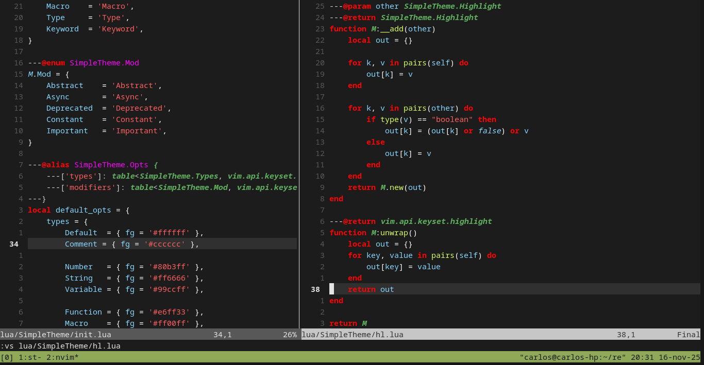

# 1emank's SimpleTheme for Nvim



More than a theme it's an "Engine" to make your own theme. Inspired in LSP
Semantic Tokens, but simplified.

There's still work to do. By now it only supports highlighting, there are
little quirks with the background color of certain tokens. But here's an
example of the basic config to get started.

Here's the Lazy plugin spec:
```lua
return {
    '1emank-nvim/SimpleTheme',
    priority = 1000, -- High value, we don't want other plugins messing with our colors
    lazy = false,
    opts = {},
}
```

Ain't that easy? But well, you would like to use your own colors. The default
colors are, with a twist, quite _vscode inspired_, so here's how you configure
your own colors.

## Configuration

This is part of the source code:
```lua
---@alias SimpleTheme.enum.Types
---|'Default'
---|'Comment'
---
---|'Number'
---|'String'
---|'Variable'
---
---|'Function'
---|'Macro'
---|'Type'
---|'Keyword'

---@alias SimpleTheme.enum.Mod
---|'Abstract'
---|'Async'
---|'Deprecated'
---|'Constant'
---|'Important'

```

Those are the two categories the opts can be defined. So in your spec, you can
do the following:

```lua
return {
    '1emank-nvim/SimpleTheme',
    priority = 1000,
    lazy = false,
    opts = {
        base = { fg = '#1a334e', bg = '#ffffff' },
        types = {
            Function = { bg = '#000000' }
            Macro = { fg = '#ff0000', italic = true }
        },
        modifiers = {
            Important = { underline = true }
        }
    },
}
```

As values, anything that will work as a third parameter for
`vim.api.nvim_set_hl` is valid. I reccomend you to stick just to format and not
linking groups though.

I hope you find it cool! :D
